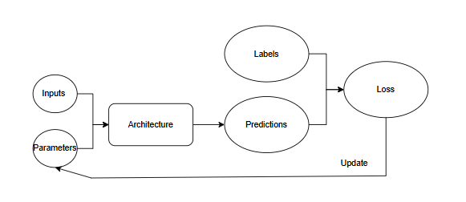

# 🎯 Fast.ai – Deep Learning Made Simple

Fast.ai is a high-level deep learning library built on top of **PyTorch** that simplifies the training and deployment of neural networks. 🚀

---

## 🧠 What is Deep Learning?

**Deep Learning** is a computer technique used to extract and transform data using multiple layers of neural networks. Each layer takes its inputs from previous layers and progressively refines them.

### 📌 In Simple Terms:

- _Machine learning_ is like regular programming—a way to get computers to complete specific tasks.
- Instead of explicitly defining steps, **Arthur Samuel** proposed letting the computer learn from examples.

### 🏆 Arthur Samuel’s Idea:

> _Instead of telling the computer the exact steps required to solve a problem, show it examples and let it figure out the solution itself._

He described his idea as follows:

> **"Suppose we arrange for some automation means of testing the effectiveness of any current weight assignment in terms of actual performance and provide a mechanism for altering the weight assignment so as to maximize the performance."**

---

### ✨ Why Use Fast.ai?

✅ Built on top of **PyTorch**  
✅ Simplifies deep learning for beginners & experts  
✅ Powerful APIs for training complex models with ease

---

## 📝 Term Meanings

- **Label**: The data that we’re trying to predict, such as “dog” or “cat”.
- **Architecture**: The template of the model that we’re trying to fit; i.e., the actual mathematical function that we’re passing the input data and parameters to.
- **Model**: The combination of the architecture with a particular set of parameters.
- **Parameters**: The values in the model that change what task it can do and that are updated through model training.
- **Fit**: Update the parameters of the model such that the predictions of the model using the input data match the target labels.
- **Train**: A synonym for fit.
- **Pretrained model**: A model that has already been trained, generally using a large dataset, and will be fine-tuned.
- **Fine-tune**: Update a pretrained model for a different task.
- **Epoch**: One complete pass through the input data.
- **Loss**: A measure of how good the model is, chosen to drive training via SGD.
- **Metric**: A measurement of how good the model is using the validation set, chosen for human consumption.
- **Validation set**: A set of data held out from training, used only for measuring how good the model is.
- **Training set**: The data used for fitting the model; does not include any data from the validation set.
- **Overfitting**: Training a model in such a way that it remembers specific features of the input data, rather than generalizing well to data not seen during training.
- **CNN**: Convolutional neural network; a type of neural network that works particularly well for computer vision tasks.
